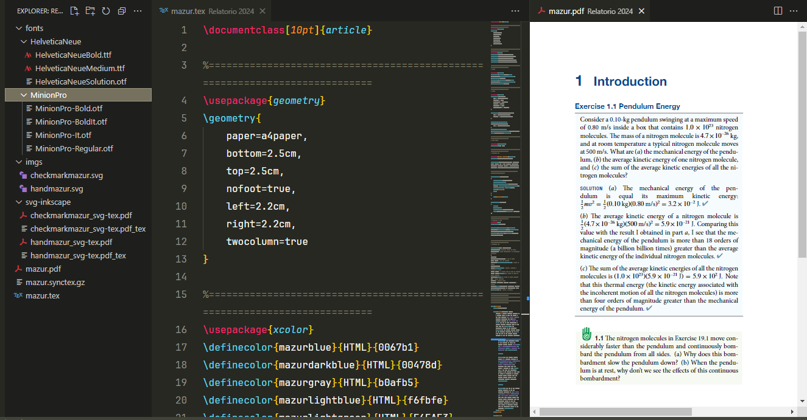

# J's LaTeX

Formatando LaTeX

Exemplo de um documento produzido usando `mazurlike_enviroments.tex`.

*Observação*: Os assets usados para confecção do documento, como imagens e fontes, devem ser baixados separadamente e organizados como mostrado na figura. 